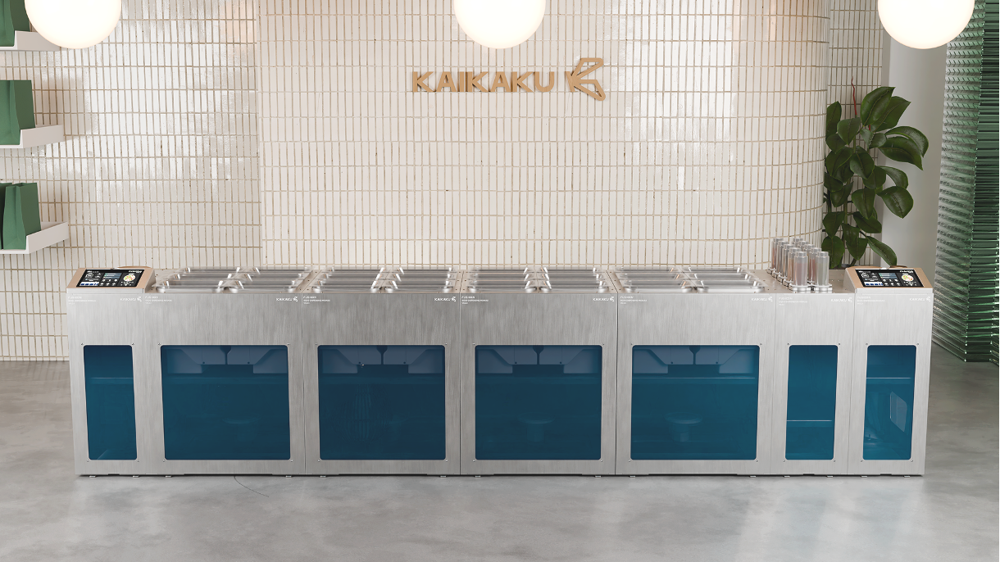
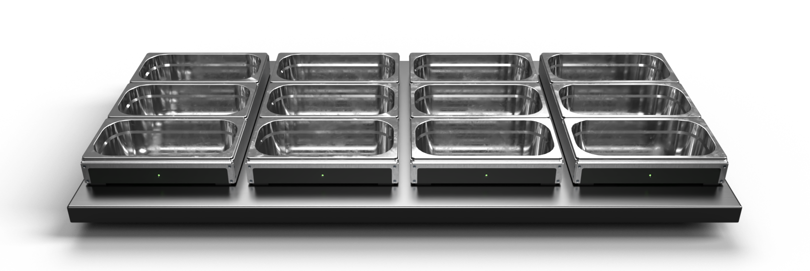

---
title: "Hardware IS Scalable - Problem to Pivot"
date: "2026-03-01"
--- 

### Extreme Ownership

Over the last three years we’ve seen billions of investment pour into software. 

> Hardware is too slow to scale
> The tech is great, but you’ll find deployments challenging
> The restaurant industry is too difficult to sell into, and the cycles are long

The subtext is clear. The hockey stick for hardware startups isn’t as steep as for software.

This is a tough pill to swallow, and I can say that this was personally the hardest realisation in my KAIKAKU journey to reconcile. Everything we’d been working towards for the past two years had been reduced to ‘too slow’. Having read Extreme Ownership the year before, the slump was short lived - the burden of proof is on us to demonstrate that hardware has value and is scalable. 

### The Truth

The majority of Venture Capital backed companies are tech. In 2025 in Europe, hardware attracted just 17% of VC funding, [while AI received 31%](https://news.crunchbase.com/venture/european-funding-nudged-higher-ai-led-2025/). In the US, [this balloons to 61%](https://www.oecd.org/en/publications/venture-capital-investments-in-artificial-intelligence-through-2025_a13752f5-en/full-report.html)

Yet in its wake, other forms of technology and innovation have been left in the shadows. Splitting technology into hardware and software is often reductive, but as the co-founder of a hardware startup, it feels difficult to blur the line between the two. 

### Fighting to Force the Future

At KAIKAKU we’re fighting to drag the archaic restaurant sector into the 21st century. Cars have been assembled with robotic arms since the 70s - where is the same drive in the food industry? For the last 2 years we’ve pushed with this passion, creating what we believe to be the highest margin improving product for Quick Service Restaurants (QSRs) - [Fusion, the world’s fastest modular food assembly robot.](https://www.linkedin.com/feed/update/urn:li:activity:7383538409685925888/)

Yet this is still merely a stepping stone. We want a paradigm shift, with tech first restaurants. Robotics and automations in the front of house, computer vision in store and in the back of house. Complete and total data collection to generate insights current restauranteurs can only dream of. To get there, we are adamant that both hardware and software are required to operate in unison. What’s the use in intelligent analytics engines without the right sensing to feed it? If you can detect issues with human portioning performance, why not automate the process instead?

Having spent these 2 years iterating daily, deployed four generations of Fusion into our living laboratory restaurant, Common Room, and serving over 15,000 real bowls to real paying customers, we felt we were ready to commercialise. Restaurants we knew were (and still are) keen to embrace technology, we’d battle tested our hardware, and we had a team of forward deployed engineers who’d spent more hours washing a robot than surely all other companies on earth combined.

### The Truth

Common Room, having been a roaring success as a living lab, allowing us to speed run 5+ years of R&D into 18 months, was closed in November 2025. We immediately switched our attention to deploying Fusion into existing restaurants. Quickly, we realised the negativity around hardware was right. Restaurants *were* keen to innovate, but deploying a revolutionary piece of hardware into hectic and varied environments was a serious roadblock. 

> One shot full automation was simply too much to ask the restaurant industry to underwrite
> 

So we were presented a choice. Double down on the negativity surrounding hardware, and further broaden the polarising divide between ‘hardware first’ and ‘software first’. Or try and prove the contrarian take - that hardware can be deployed into an antiquated industry, with short sales cycles, and fast scaling.

**We chose the latter.**

### Our Pivot

Within a few hours we’d decided. We needed a new product that was:

- Strictly a subset of Fusion technology, to minimise additional R&D
- Sufficiently modular to remain compatible with **all** restaurant categories
- Extremely simple to manufacture and assemble
- Able to solve a small problem, immediately

All restaurants struggle with Cost of Goods Sold (COGS) tracking, with zero visibility on portion accuracy. Let’s fix that.

Laser cut prototype that afternoon. Full scale proof of concept by the end of the week. CAD completed the week after. Patent attorneys instructed the same day. Mass event detection and allocation algorithm working by week 3.

We had a patent filed protecting our force plate architecture by the end of week 5, and just 30 working days after inception, we had our new **hardware** **product deployed in a real restaurant.** 

Three days later we were deployed in a second location (in a different country). One week after that we had our third deployment.

### Changing the Tide

This story is meant to be just one datapoint in the wave of founders and engineers that know hardware innovation has just as much value to give. But it’s also a call to move on from the ‘hardware *is* hard - that’s why they call it hardware’ mantra. The way to driving growth and investment into hardware startups isn’t to complain that too much money is going into software - it’s to take onboard the entirely valid criticisms that hardware development and deployment can be slow, and do something about it.

We live in a world where software development has been accelerated hundreds of times over. But 3D printers are no longer the hobbyists toy - they are ready for full scale manufacturing. CAD packages can now be run in browser on laptops. Custom PCBs and parts can be ordered and arrive within days.