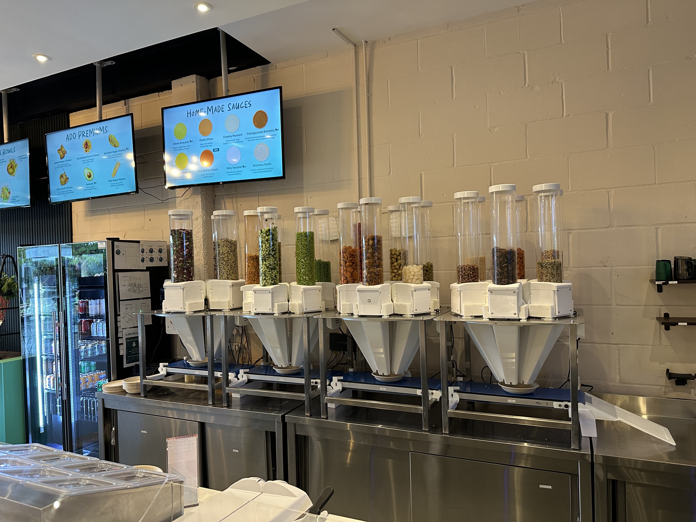
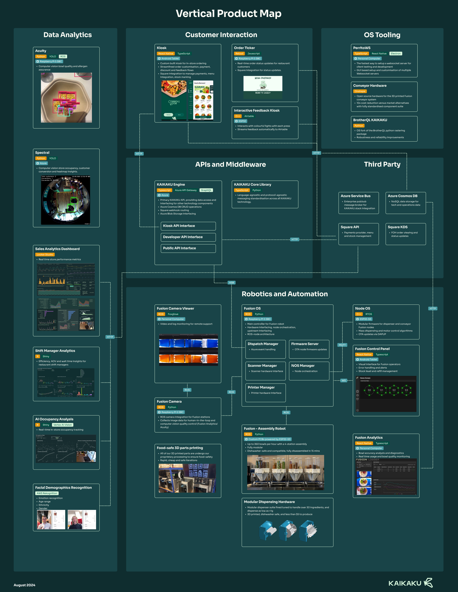

Dear SoTA,

> This was originally sent to the SoTA newsletter on 22nd July 2025.

There are many ways to make a robotic system. You can purchase off-the-shelf manipulators, such as a [KUKA](https://www.kuka.com/) robot arm and focus on advanced performance through software. You can use off-the-shelf software solutions such as [Viam](https://www.viam.com/), to get your custom hardware up and running quickly. You might choose not to worry about electronics, and buy off-the-shelf PLCs ([Programmable Logic Controllers](https://en.wikipedia.org/wiki/Programmable_logic_controller)) and all-in-one actuators, from [Oriental Motor](https://www.orientalmotor.com/) for example.

Unfortunately any of these combinations leaves you at the mercy of a painful integration challenge, at potentially significant cost. At KAIKAKU we’ve decided to do the difficult thing and undertake the entire engineering stack in-house. This is known as vertical integration, and its proving particularly popular in recent years, with companies such as [Figure](https://www.figure.ai/) in-housing their entire humanoid stack from hardware to software and even their own [Vision Language Model](https://www.figure.ai/news/helix). At first this seems like a daunting prospect, and it certainly requires a team of generalist engineers who aren’t afraid to switch from a week of CAD, to a couple days of embedded firmware, to troubleshooting 3D printers. However the benefits can be tremendous.

Fusion is our flagship product, a food assembly robot designed to be extremely cheap and performance focused. No gimmicky robot arms, no anodised frills, mostly 3D printed to keep iteration rate high, and worrying more about bowl throughput than aesthetics. This pays off; the BOM cost for Fusion V3B (shown above) is around £12k, a fraction of Sweetgreen’s Infinite Kitchen system that c[osts $450-500k to install](https://finance.yahoo.com/news/sweetgreen-robot-kitchens-yield-10-093110289.html), while still achieving a peak throughput of one bowl per 15 seconds.

This wouldn’t be possible without being vertically integrated. We have a very lean team, of just three engineers, and one technician. Between us we do:

- All mechanical design, from the 3D printed dispenser blocks, to the steel frames, to the conveyor belt mechanisms.
- All software. Not just robot focused software such as ESP32 firmware, and Raspberry Pis running ROS2, but the entire stack, including fully fledged ordering kiosks written in React Native, cloud infrastructure, and even control panels for interacting with Fusion.
- All electronics and control. We design the PCBs in house, and use hobbyist DC motors. The mass control system that achieves greater-than-human dispensing accuracy is also designed and tuned by us (usually while we’re behind the counter).
- Manufacturing. While we don’t make *every* component in the restaurant, we have a fleet of 3D printers, a laser cutter, various power tools, and Mate, our technician, in the basement. Previous robots were as much as 90% made in house, helping us achieve our Made in Britain certification

So why do we stretch ourselves thin and try and take all of this on? Simply to maintain a high rate of iteration. As a startup fighting to achieve PMF, our only goal is to speed towards a successful and functional product. To achieve this we need to iterate on the design daily, sometimes hourly. If we focused entirely on the mechanics of dispensing technology, and suddenly found a motor controller to be causing issues, we would be at the mercy of support engineers helping us integrate with a black box. If we went all in on AI first kiosk software for example, we’d be limited by whatever existing restaurant automation hardware already exists (very little). When you’re trying to solve a large problem (automating front of house restaurant operations) in an industry that’s very tech lagging (restaurants), it’s hard to predict which tools require focus to progress (hardware, software, sensors, data analysis, supply chain etc). When all of these are under one roof, its much easier to prioritise the issue at hand.

This culture of vertical integration persists outside of tech development at KAIKAKU. For over a year we have operated Fusion in our own restaurant, Common Room. This serves primarily as a living laboratory, giving us a high fidelity sandbox to test, break and test Fusion. However when we started we didn’t know what type of restaurant, or exactly what pain points our automation would have to focus on. So again, we decided we had to do it all ourselves to maintain the highest rate of learning possible. Everything in Common Room, from the menu development, to the marketing photography, to the staff hiring and training, to the construction specification and even interior design was done entirely in house; not one moment of consulting. Much like vertically integrated Fusion development, this is quite hard. However without this culture of taking on the entire value chain, it is unlikely that a team of only seven could go from vague idea, to a restaurant taking on $1m in ARR, with a fully custom robot deployed for over 11 months, in just two years.